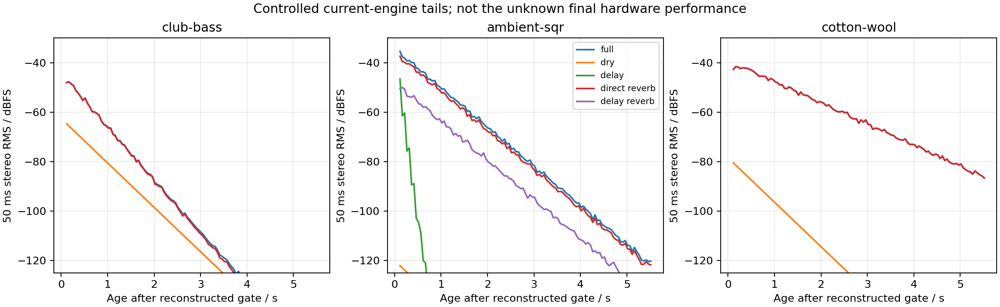

# Reverb tails: verified engine paths and input-halt controls

**Club's later Side deficit remains in the reverb path. Current-model release, Lower dry output and active delay do not explain it.** This experiment isolates the model's paths; it does not recover hardware stems or uniquely identify a decay, damping, width or routing coefficient. No production source or patch changed.

The complete [receipt](reverb-tail-bus-decomposition-2026-09-15.json) retains the frozen build, source and executable hashes, original preset/MIDI/audio identities, eight stems per case, all 18 halts, synthetic controls, per-stage causality checks and every declared interval.

An [independent review](reverb-tail-bus-independent-review-2026-09-15.json) verified 166 artifact hashes and 1,038 numerical fields, including every halt and impulse check. It found no consequential blocker; all baseline, stem and halt outputs remain below the limiter. Independently computed pairwise power cross terms agree within 3.61×10⁻⁸ of full power.

## Club: exact existing first-gap supports

The unchanged published Club Bass patch is DUAL, centered, AMP releases 0/0, delay OFF and Upper/Lower reverb sends 50/0. Reverb TIME77, SIZE7, 1 ms pre-delay and HF damping −36 dB at4 kHz remain unchanged. The original recording, exact patch and reconstructed MIDI hashes are reverified. Source release times, original effect state, capture processing and the exact recorded patch revision are still uncertain.

The table uses the previously frozen production-prefix lag **+232 samples** and scalar **1.8256797473972683**. There is no new gain or lag fit. Mid=(L+R)/2 and Side=(L−R)/2. These are stereo waveform RMS values over the complete intervals, not the earlier short-window band-slope estimator. Negative errors mean the current model is quieter.

| Original recording time | Hardware stereo / Mid / Side RMS, dBFS | Model minus hardware stereo / Mid / Side, dB |
|---|---:|---:|
|2.30–2.65 s, existing training support |−41.718 /−43.284 /−46.908 |−2.693 /−3.270 /−1.598 |
|2.65–3.00 s, existing check support |−47.106 /−50.858 /−49.484 |−4.791 /−2.717 /−7.355 |
|3.00–3.25 s, diagnostic, clipped to common coverage |−57.037 /−60.288 /−59.819 |−1.653 /−0.523 /−3.002 |

From the first support to the second, the relative stereo level falls **2.098 dB**, while the Side deficit grows **5.757 dB**; the Mid error improves0.553 dB. This difference is conditional on the frozen reconstruction and capture. It is not a recovered hardware transfer function.

| Model component, before applying the common comparison gain |2.30–2.65 s RMS |2.65–3.00 s RMS |
|---|---:|---:|
|Upper direct-fed reverb, stereo |−49.718 |−57.224 |
|Upper direct-fed reverb, Side |−53.735 |−62.068 |
|Lower dry output after analog coupling, Mid |−67.097 |−73.378 |
|Lower dry output, Side |Exact zero |Exact zero |
|Dry voice buses before the output circuit |Exact zero |Exact zero |
|Delay return, delay-fed reverb and Lower direct-fed reverb |Exact zero |Exact zero |

The Upper dry Side is below−320 dBFS, numerical roundoff. Summed Side agrees with Upper direct-fed reverb to rounding. The nonzero Lower **dry-output** tail is stored state in the linear output coupling circuit after the voice bus has become zero; it is mono and cannot explain the Side deficit. Its level follows the current circuit's0.484 s coupling time constant. This is a model-state observation, not evidence that the original capture has exactly that state.

Halting all new source buses or all new reverb input at reconstructed final gate2.21 s removes only4.50%/4.95% relative Side waveform RMS in the two supports. This is a norm of the difference, not a fraction of independent power. Halting either input250 ms after that gate changes **no sample anywhere**. The existing gap is therefore free of continuing model voice/reverb excitation at that later time. Hardware excitation history and modal weights remain unknown; the previous actual-network controls showed that short slopes vary with excitation even at fixed coefficients.

## What was built and verified

One native and one instrumented renderer use frozen production revision `e44363925ba9edbe9321fcdd21caf7d656ddb7dc`, including the selected0.4 reverb return. Every original DSP file and `RenderMidi.cpp` is pinned. Instrumentation exists only in ignored build copies. All three native outputs and instrumented outputs are byte-identical to the prior shipping WAVs:

| Case |Shipping/native/instrumented WAV SHA-256 |Maximum stem-sum error before limiter |
|---|---|---:|
|Club Bass |`7450ab25f2a776ca21725f7afee23fdcb218c8eee64b53f7a44daa3202670ddd` |3.57×10⁻⁸ |
|Ambient SQR nominal-v100 |`3c2e7de05f61f81f065154dd6592ef55972250adb74e74ee6ba6dac9aa54fad0` |1.06×10⁻⁸ |
|Cotton Wool |`3367e7a2077a96902cb4404d5051b3f6f8f5a1d3cdde915b9739984b8ca4f13c` |2.09×10⁻⁸ |

The capture records actual post-voice dry/send buses, per-part contributions, original control-tick boundaries, and per-sample master/pan gains. Voice order, oscillator/LFO phase, overdrive/filter/AMP processing and smoothed sends are preserved. Replay uses those actual buses through the original effects code: Upper/Lower × dry, delay return, direct-fed reverb and delay-fed reverb. Every path starts at the same time and processes the entire input history. The complete replay matches native PCM exactly over the original render. Part grouping and independent float network states account for the small recombination errors; no component is fitted.

AnalogOutput is the current linear small-signal circuit model. Its output limiter is nonlinear. A deterministic200 ms two-source burst through the exact Ambient effects validates this distinction:

| Control |Peak before limiter |Limited channel-samples |Pre-limiter sum relative RMS error |Post-limiter sum relative RMS error |
|---|---:|---:|---:|---:|
|Quiet, fixed scale1 |0.064916 |0 |5.35×10⁻⁸ |5.35×10⁻⁸ |
|Overloaded, fixed scale100 |6.49163 |19758 |5.37×10⁻⁸ |0.62768 |

All actual baselines and their stems stay below the limiter knee. An overloaded signal must be summed before the shared limiter; separately limited tracks are not additive. The numerical guards are engineering checks, not perceptual-equivalence thresholds.

## Halt placement, state and support

Three controls start at the final reconstructed gate and again250 ms later: zero all new post-voice dry/send buses; zero new direct-plus-delay reverb input; remove only new delay-to-reverb input. Reverb halts occur **before pre-delay**, not at the delay-network injection or wet output. Existing delay buffers, pre-delay, diffusers, network, output filters and switch smoothing continue unchanged.

Separate impulse controls measure strict causal onsets. Reverb changes cannot emerge before1353 samples in Club/Ambient or5719 in Cotton, including pre-delay and the shortest network path. AnalogOutput's first nonzero response is two samples later. Its74-sample group delay is a different quantity; the engine's93-sample overall latency is not added again to already captured post-voice buses. Every halted output is byte-identical to baseline through its entire required per-stage causal prefix; observed first changes and identical complete controls are retained.

| Case |Last reconstructed gate |Last nonzero voice bus after gate |Original render ends |Controlled extension ends |
|---|---:|---:|---:|---:|
|Club |2.210 s |3.741 ms |5.250 s |8.210 s |
|Ambient |0.730 s |26.259 ms |2.775011 s |6.730 s |
|Cotton |4.750 s |48.594 ms |7.000 s |10.750 s |

Zero active voices alone is insufficient to justify an extension. Here an independent SMF parse verifies **all tracks ended before the original render ended**; every replayed event precedes that boundary, all voices ended, and each stored arpeggiator is off. Extensions continue the exact effects state with zero new buses and held final gain/pan. They are controlled model continuations, not transcriptions of later hardware music.

The frozen tail-age supports are .09–.44, .44–.79,1.05–2.55 and2.55–5.55 s after each reconstructed gate. No tail interval was chosen by a candidate's score. The plot is a descriptive50 ms trajectory; very low model levels do not establish audible hardware coverage.



## Ambient and Cotton: retained counterevidence and limits

- **Ambient remains mixed.** Its matched opening.405–.775 s uses the old−2205-sample alignment at the search boundary and gain7.46790500635611. Current stereo RMS is1.486 dB below hardware, while Side is13.134 dB above it. Both layer reverbs and modulated delay contribute. The final-gate controls start after the aligned measured opening; their zero effect there cannot validate its tail. In the controlled later model continuation, removing delay-to-reverb input at the gate changes later RMS by−.13 to−.27 dB; at gate+250 ms, the largest relative waveform change is.00813 and level change.00572 dB. Earlier delay-fed network state remains. The sum of separate component powers is only.480–.488 of full power because of coherent cross terms; it must not be read as a percentage allocation. The original11.65–13.15 s hardware tail has **no matched MIDI** here.
- **Cotton has a clean model path.** Only Upper dry and direct-fed reverb are active; delay send0 and the disabled Lower produce exact zero controls. Matched opening1.25–5.00 s uses old lag−1346 and gain3.5906029484109427; stereo RMS is.688 dB below hardware and Side2.561 dB above. In the controlled later tail, removing source input at the gate changes RMS by−.16 to−.30 dB; the same halt at gate+250 ms changes no sample. Its13% relative waveform effect reflects changed earlier excitation, not continuing late release. The hardware17.25–21.75 s decay is **not matched** by the opening MIDI. Its prior conditional8.2–8.5 s effective decay observation remains separate from this experiment.

## Decision

No coefficient is uniquely identifiable here. The current Club first-gap Side problem belongs to the existing reverb-path response/state; another DUAL multiplier, a mono output-coupling correction, or longer current voice release is not supported by these controls. They do not distinguish intrinsic network behavior from a different original modal excitation/capture. Retain the prior failed short-slope/recurrence controls when considering a damping or topology hypothesis.

Cotton still provides the strongest bounded **longer-tail experiment** around its conditional8.3 s effective TIME104 observation. Its current model has no late source or delay feed to absorb that difference. That is sufficient motivation for a labeled fixed-input trial, with held-out late source supports and Class A's contrary TIME86 observation preserved; it is not a global time-curve calibration or shipping recommendation. No equivalence claim follows.

## Reproduce

Prerequisite: the existing [shipping integration receipt](reverb-return-integration-2026-09-15.json) and its cached unchanged MIDI/preset/shipping WAVs, plus the named original MP3/excerpt corpus. The builder requires working DSP/renderer bytes to match its requested revision and reads the revision directly from git. Use the matching checkout or an isolated worktree if production has since changed. It never edits production files.

```sh
OPENBLAS_NUM_THREADS=1 VECLIB_MAXIMUM_THREADS=1 python3 \
  Tools/decompose_reverb_tail_buses.py \
  --revision e44363925ba9edbe9321fcdd21caf7d656ddb7dc \
  --output build-fidelity/reverb-tail-buses/reproduction
OPENBLAS_NUM_THREADS=1 VECLIB_MAXIMUM_THREADS=1 python3 \
  Tools/assess_reverb_tail_buses.py \
  --run build-fidelity/reverb-tail-buses/reproduction \
  --output build-fidelity/reverb-tail-buses/reproduction/assessment
```

The retained run is `build-fidelity/reverb-tail-buses/run-01`, final measurement `assessment-04`. Earlier assessment revisions add MIDI-queue and Mid/Side reporting and fix plot colors; all original native/stem/halt audio and previously computed interval values remain unchanged. Protocol receipts were written before building and before synthetic/public measurement. Only these analysis tools and evidence artifacts were added.
