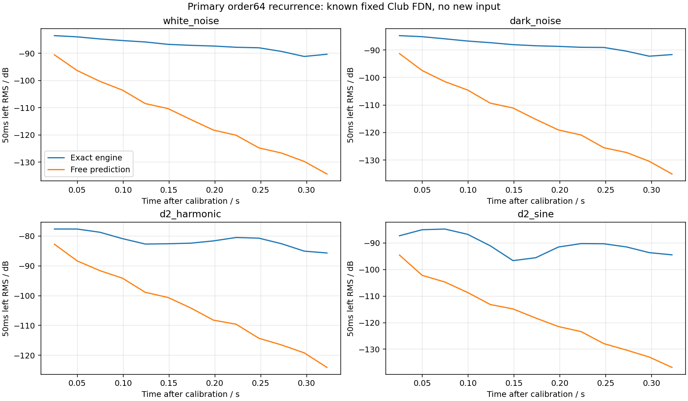

# Reverb-tail discrimination: short-gap recurrence fails its control

**No new decay, damping or layer-routing parameter is identifiable from this experiment.** A shared linear recurrence cannot predict the known current Club reverb from the available short supports. The numerical control passed on simple known modes, but failed on the actual engine. Per the frozen protocol, no new hardware poles or preferred model order were fitted.

## What the existing references can distinguish

| Reference | Source release / routing / delay | Useful remaining evidence |
|---|---|---|
| Club Bass | Both stored AMP releases 0; delay off; DUAL, reverb sends 50/0 | Best of these three for conditional reverb-only gaps. Current level falls relative to the recording by 2.31 dB between frozen training/check supports. Initial modal state and true recorded gates remain unknown. |
| Ambient SQR | Two different AMP releases 30/22; two unequal reverb sends 43/112; active modulated delay, also feeding reverb | A combined-effects mismatch. Neither opening nor late side signal isolates intrinsic reverb decay. Extending the first gate did not remove the known envelope regression. |
| Cotton Wool | SINGLE, AMP release 39; delay send0; neutral reverb damping | Strongest longer-tail observation: effective broadband decay 8.2–8.5 s against current isolated target 7.011 s, conditional on final excitation, original controls and capture. |

The current engine accumulates each panned/leveled voice once in dry and once in each weighted send. Delay feeds the shared mono reverb input along with direct tone sends; Lower does not get a separate network. The prior independent layer-phase grid retained Club/Ambient envelope regressions in every tested state. These facts do not identify a missing DUAL multiplier.

Current AMP release time mappings are 2.00 ms at raw 0,9.03 ms at 22,15.61 ms at 30 and28.92 ms at 39 (time to −60 dB). Those are model values, not measured hardware release times. Treating the stored raw numbers as known source durations would assume the mapping that a source-release audit should test.

Relevant earlier evidence: [Club decay](club-reverb-decay-2026-09-15.md), [damped-tail coverage](damped-reverb-tail-feasibility-2026-09-15.md), [Ambient gate sensitivity](ambient-first-note-followup-2026-09-15.md), [Cotton decay](cotton-reverb-decay-2026-09-15.md), [layer routing/phase control](dual-layer-phase-sensitivity-2026-09-15.md), and [failed finite-window stereo-transfer control](reverb-stereo-transfer-feasibility-2026-09-15.md).

## New control, frozen before results

A finite-dimensional linear time-invariant system has a shared recurrence after its input stops, although different excitations give different modal amplitudes. The proposal was to test whether such a recurrence could transfer between the three already selected Club gaps without reducing each gap to one unstable dB slope. Settled network settings provide the intended context, apart from finite-precision and denormal handling.

The [protocol](reverb-tail-recurrence-protocol-2026-09-15.json), SHA `e8ea594299b6d63273afb00d2c385671d2850523430627e44247ed84a4096410`, was saved before this test. It uses the four existing, hash-pinned actual-engine Club controls: 200 ms white/dark-noise and D2 harmonic/sine bursts, exact current reverb settings, no delay, and no source after the burst. All original/current/frozen DSP hashes, fixture/binary hashes and complete control WAV hashes were reverified. No new engine build was required.

The analysis applies a causal 2205-tap 80–640 Hz FIR and decimates to 2100 Hz. FIR and engine delays are each included once. Two noise tails train one shared real recurrence, pooled across their left/right channels, on delay-compensated stimulus time .29–.64 s. Predictions start with each signal's last training samples and run freely over .64–.99 s, including the two distinct held-out excitations. No later filtered check sample enters fitting or free prediction. These are filtered-sample boundaries: compensating the FIR group delay makes the last training sample depend on raw input through stimulus time .664558 s, about25 ms beyond the nominal .64 s boundary. Thus raw source support is not strictly separated there. This gives the already failing predictor more nearby source information; it does not explain its failure through insufficient isolation. Burst end is .20 s, so the nominal training start is .09 s after source termination, matching the operational first Club gap age. There is no later gain, time alignment, pole reflection or order selection.

Order 64 is primary; 16/32/128 are fixed sensitivities. The predeclared numerical discrimination target requires every later 50/100 ms RMS window in every channel/control to stay within 0.5 dB. This is deliberately smaller than Club's previous 2.31 dB relative level drift; it is **not a perceptual equivalence tolerance**.

## Retained results

Eight known pairs of damped modes pass at every order, with maximum relative waveform prediction error 5.98×10⁻⁹. A separately planted new input after training causes the expected prediction error. The identical pure damped sinusoids can also represent released oscillators: even perfect recurrence alone cannot distinguish source release from reverb modes.

| Recurrence order | Largest later-envelope error: white / dark / harmonic / sine |
|---|---|
|16 |93.41 /94.74 /103.52 /105.76 dB |
|32 |100.97 /101.79 /103.65 /98.82 dB |
|64, primary |43.94 /43.35 /46.18 /43.78 dB |
|128 |9.39 /9.39 /16.66 /15.31 dB |

Every actual-engine case fails. Primary one-step training relative RMS error is only .0434, but its long free prediction decays far too quickly. A plausible one-step predictor is therefore inadequate for decay identification. Dense delay-network modes, finite support and limited predictor order matter; these results do not prove every recurrence estimator impossible. Noise-free float controls are intentionally allowed below hardware noise guards. Their failure cannot be blamed on MP3 or unknown performance.



## Decision and path toward an audible change

- **Do not fit Club HF damping:** its useful 80–640 Hz bands are far below the 4 kHz corner, and neither short slopes nor this recurrence isolates a damping law.
- **Do not infer a DUAL send multiplier or Ambient decay correction:** source beating, releases, unequal layer sends and active delay remain entangled; the routing audit found no extra accumulation.
- **Cotton TIME 104 is the strongest bounded candidate context:** testing a longer effective tail near 8.3 s is evidence-supported as an experiment only. Class A's weaker 3.4–3.6 s observation at TIME 86 contradicts a universal time multiplier; preserve that counterexample.

The next discriminating full-engine experiment should expose **component contributions**, before changing a coefficient: retain exact original MIDI/preset baselines, add isolated diagnostic dry/Upper/Lower/delay/direct-reverb/delay-fed-reverb stems, and prove their recombination matches baseline output below the limiter. Then halt only new reverb input at known synthetic gate times while preserving network state. This separates continuing release/delay excitation from free decay without choosing oscillator phases or fitting gains. Use Club's already frozen three gaps, Ambient's existing gate variants/late support and Cotton's fixed 17.25–21.75 s support as qualified comparisons; do not select new favorable windows. Public original stems are unavailable, so model decomposition still cannot authenticate hardware source release.

Only if the supported late mismatch survives those source-contribution controls should a narrow Cotton time hypothesis be rendered with one frozen early gain and later held-out comparison, alongside Class A and the existing Club/Ambient regressions. That is a route to testing an audible improvement, not a justification for a shipping change now.

## Reproduce

```sh
OPENBLAS_NUM_THREADS=1 VECLIB_MAXIMUM_THREADS=1 python3 \
  Tools/probe_reverb_tail_recurrence.py \
  --protocol Docs/fidelity/source-audits/reverb-tail-recurrence-protocol-2026-09-15.json \
  --output build-fidelity/reverb-tail-recurrence/reproduction
```

Regenerate prerequisite controls with the [Club tool](../../../Tools/analyze_club_reverb_decay.py) if absent. The [complete result](reverb-tail-recurrence-2026-09-15.json) retains all coefficients, singular values, pole-radius diagnostics, windows, failures and source hashes. No production file changed; no equivalence claim is supported.
