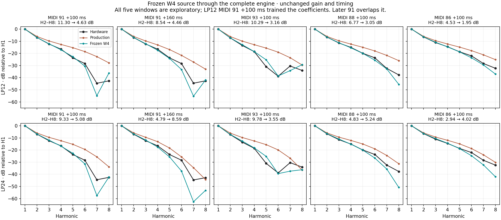

# Classic Saw correction fitted through the complete engine

**The frozen W4 source is a useful provisional improvement, with measured
counterexamples.** It substantially improves the recorded alias pattern across
eight pitches and both filter slopes, and improves Air Lead's spectral distance.
Several LP24 harmonic estimates and quiet spectral bins become less accurate.
Neither complete SH-201 output agreement nor market-wide superiority is established.

## What was fitted

The [proposal](asymmetric-w4-engine-test-proposal-2026-09-15.md) was executed
against production revision `545b3d3`. One asymmetric, four-sample correction
around the free-running classic Saw wrap replaces polyBLEP. Its 32 cubic-spline coefficients
were learned **through the complete current engine**, including the voice filter,
AMP, oversampling path and analog output model. No additional postfilter was
transplanted into the oscillator.

Only one 80 ms LP12 Q0 passage, MIDI 91 at +100 ms, selected the coefficients.
The unit ramp, recipe, gain 4.137125725839024 and −1406-sample alignment were
fixed. One waveform phase and output-window DC were nuisance variables;
neither enters the final canonical-phase comparison or production sound.
The finite search evaluated 476 valid phase solutions and retained the lowest
observed residual. It does not establish a global optimum.

The original performance MIDI accompanies the creator's dry filter recordings.
The dry panel recipe is reconstructed, not authenticated original SysEx.
The official preset comparisons use stored preset bytes with reconstructed
performances. Their velocities, gates, capture path and patch revision remain
uncertain. Sources and exact hashes are retained in the linked receipts.

## Engineering controls before hardware fitting

- Both fresh native dry renders and the exact polyBLEP nested in W4 reproduce
  the retained complete LP12/LP24 WAVs byte for byte.
- An independently rendered planted source, including an unknown phase,
  is recovered before opening hardware audio. Canonical-phase transfer error
  power is below 2.57 × 10⁻¹⁴ across both slopes and all specified supports.
- The independent source review checks 55,488 scalar samples, complete-engine
  state handling, analytic mean subtraction, overlap and unchanged phase clocks.
- The selected vector's separate complete-engine training render agrees with
  the linear prediction to 6.05 × 10⁻⁸ relative RMS. Its actual training error
  power is 0.0021433. All dry candidate renders remain below filter and output
  limiting thresholds. Training residual is not an equivalence or audibility score.

See the [prerequisites](saw-w4-engine-prerequisites-2026-09-15.md),
[independent review](asymmetric-w4-engine-independent-review-2026-09-15.md),
[frozen vector](saw-w4-engine-candidate-2026-09-15.json) and
[fit/phase-control receipt](saw-w4-engine-fit-2026-09-15.json).

## Comparisons after freezing the coefficients

Every comparison uses the same selected vector. Dry gain and alignment are
unchanged; primary measurements exclude the MIDI 91 training event. Activity
and harmonic eligibility come from the original recording. Weak or unresolved
candidate lines remain visible and in the required denominator. The public
recordings were already inspected, so these are exploratory transfer checks,
not blinded independent discovery data.

| Measurement | Production → W4 |
|---|---:|
| LP12 alias proxy RMS, excluding trained note 91; 182 original line-windows | 23.690 → 7.911 dB |
| LP24 alias proxy RMS, excluding trained note 91; 150 original line-windows | 27.309 → 11.435 dB |
| LP12 isolated-note H2–H16 ratio RMS | 0.729 → 0.824 dB |
| LP24 isolated-note H2–H16 ratio RMS | 0.947 → 1.542 dB |
| LP12 MIDI 84 spectral convergence | 0.07392 → 0.04454 |
| LP24 MIDI 84 spectral convergence | 0.07659 → 0.06577 |
| Air Lead spectral convergence | 0.85225 → 0.81364 |
| Ten-preset mean spectral convergence | 0.53892 → 0.53471 |

Lower is better. The [broader alias check](saw-w4-alias-transfer-2026-09-15.md)
improves all 32 note/offset/slope windows. Individual contrary bins remain:
147/182 LP12 and 123/150 LP24 line errors improve outside note 91. Unresolved
peaks are search-maximum proxies, not precise physical-line estimates.

The five previously selected high-note windows all improve LP12 H2–H8 ratio
RMS. LP24 improves in two and regresses in three. The first LP12 panel trained
the source; the next note-91 panel overlaps it by 20 ms. The graph labels both
limitations. Quiet-bin log errors also increase: over the post-calibration dry
support, mean error rises by 0.43–0.96 dB for LP12 and 0.16–0.60 dB for LP24
across four FFT sizes. Envelope RMS error decreases slightly on that support.
These different metrics measure different aspects; gains in strong spectral
components do not erase quiet-harmonic regressions.

All ten official native controls reproduce production exactly. All five
presets without active classic Saw remain byte-identical with W4. Air Lead's
spectral improvement survives a separate original-only activity mask, but its
log-error gain shrinks to 0.137 dB. Brassy, So Juno and Vangelead regress by
0.391, 0.552 and 0.629 dB respectively on that common mask. Dist Bass changes
negligibly. The ten-preset original-only mean log error increases about 0.144 dB.
The legacy union-mask scores are retained separately, without substituting
candidate-dependent bins for this diagnostic.

Full results: [dry comparison](saw-w4-engine-dry-comparison-2026-09-15.json),
[independent numerical review](saw-w4-engine-dry-review-2026-09-15.json),
[all ten presets](saw-w4-official-comparison-2026-09-15.md), and
[common-mask diagnostic](saw-w4-official-original-mask-2026-09-15.md).

## Decision and remaining uncertainty

The broader-register alias improvement, high-register harmonic gains and
Air Lead improvement justify a provisional classic-Saw correction. This
decision accepts the explicit counterexamples above; it does not infer that
they are inaudible. The coefficients may absorb errors in the current downstream
model or recording path. They are not recovered Roland firmware constants.

The remaining LP24/time-dependent response, quiet alias notches and official
preset residuals remain useful targets. Further changes must keep these same
comparisons and their uncertain original inputs visible. A completed engineering
integration is a checkpoint toward the replication goal, not proof of identical
hardware output.

## Production integration boundary

The correction is static and allocation-free. Its support remains 4/44100
seconds on each side of the wrap at every host rate. The oscillator phase
clock, fractional wrap timing, other waveforms and output latency are retained.
Source math and physical-duration checks at other rates establish implementation
consistency, not the SH-201's aliased host-rate output.

The first integration passed all twelve complete candidate replays exactly,
but failed an existing hard-sync ramp-identity regression test: correction
support leaked into samples after a forced reset. The final integration
therefore retains the previous Saw/polyBLEP path for **OSC1 under SYNC**,
including its naive reset sample. OSC2 and ordinary MIX/RING Saw use W4.
This preserves the existing forced-reset behavior while its hardware response
remains uncalibrated. No test threshold was relaxed. All twelve benchmark
cases use MIX, so the forced-reset guard does not redefine their fitted model.

The final [production replay](saw-w4-production-integration-2026-09-15.md)
matches all twelve candidate WAVs byte-for-byte across 4,966,322 stereo frames.
All 35 CTests and universal AU/VST3/standalone builds pass; the
[build receipt](saw-w4-production-build-2026-09-15.json) preserves the initial
Sync failure and final successful suite. The
[independent source review](saw-w4-production-source-independent-review-2026-09-15.md)
records 8,364 focused checks and the sample-rate limitations above.
