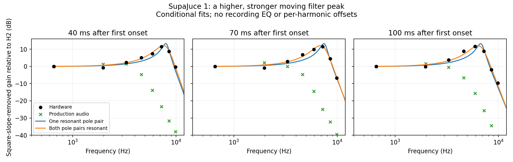

# SupaJuce 1: resonance strength and cutoff placement

**Finding:** the official recording has both a substantially stronger resonant peak and a higher moving cutoff than the archived WIDE-correct render made before the resonance retuning. A two-pole-pair resonant model fits the early upper-square harmonic shape better than the current single-resonant-pair model, but the recording does not uniquely identify Roland's topology or a complete resonance-knob curve. No production DSP or preset was changed by this analysis. The baseline and hashes below remain fixed even if a later empirical candidate is promoted; fitted topology is not a recovered Roland algorithm.

## Primary evidence and isolation

The source is Roland's [SupaJuce 1 MP3](https://www.rolandus.com/go/sh-201_patches/mp3/LEAD/TOP8_SupaJuce1.mp3), associated by name with record 6 in the [official LEAD bank](https://www.rolandus.com/go/sh-201_patches/shl/SH-201_Patch_LEAD.zip) on [Roland's patch page](https://www.rolandus.com/go/sh-201_patches/patch_lead.html). Exact source, input and script hashes are in [the JSON](supajuce-resonance-audit.json); the [preceding octave audit](supajuce-pitch-audit.md) verifies the 2:1 oscillator ratio.

The active Upper tone has two square oscillators, MIX, LP24, resonance40, cutoff27, keyfollow50, filter A3/D61/S74/R63/depth+31, FLAT low-frequency control, and overdrive off. Delay and reverb are enabled. The [Roland MIDI Implementation p. 5](https://static.roland.com/assets/media/pdf/SH-201_MI.pdf) specifies these fields; [Owner's Manual pp. 34–37](https://static.roland.com/assets/media/pdf/SH-201_OM.pdf) describes resonance and envelope behavior qualitatively, without a Q table or DSP topology.

At the lower square's fundamental `f`, the higher square contributes only `2f, 6f, 10f, 14f, …`. The lower square's odd harmonics do not overlap that family in a linear signal path. Ratios **H6/H2 through H30/H2** remove scalar recording gain and oscillator balance. Adding `20 log10(Hn/2)` removes the ideal square's known `1/n` amplitude slope. It does not remove frequency-dependent recording processing, numerical oscillator rolloff, effects, or nonlinear mixing.



At 70 ms after the first onset, the apparent filter gain relative to H2 reaches about **+11.5 dB near H22, approximately 7.25 kHz**, then falls on H26 and H30. Measuring both sides of this peak constrains cutoff and damping far more strongly than a few harmonics below it. The modeled production cutoff at the same time is **3766.77 Hz**, with first-stage damping **0.855124** and second-stage damping **1.2**. The trace-producing executable was independently checked to produce the exact production WAV bytes (`c3553cd8a667d6e9bb9083069112b3a79055b4206b2319f063956da77ee19db2`). Raising resonance alone would leave this peak in the wrong place.

## Constrained shape fits

For the current TPT family, `x=tan(πf/fs)/tan(πfc/fs)` and a second-order low-pass has magnitude `1/sqrt((1−x²)²+(k*x)²)`, with damping `k=1/Q`. Tested alternatives are LP12; LP24 with one variable damping and second damping1.2 or√2; LP24 with equal variable dampings; and a four-one-pole ladder comparator `1/((1+jx)^4+r)`. Ladder feedback `r` is a different parameter from pole damping. Cutoff is bounded300–15000 Hz; positive damping is bounded0.03–2.5, and ladder feedback remains below4. No per-harmonic offsets or recording EQ are fitted.

Five overlapping 30 ms windows, centered40–100 ms after the first onset, estimate **one common damping** and a separate nuisance cutoff in each window. The other five notes freeze that damping and topology while fitting cutoff only. This is held-out **shape** validation, not a prediction of envelope timing or the cutoff control law.

| Model | First-note common parameter | First-note RMS | Other five notes' early RMS errors |
|---|---:|---:|---|
| LP12 | k0.2089, Q4.79 | 1.72 dB | 3.22, 3.06, 2.61, 1.59, 1.85 dB |
| LP24, second k1.2 | first k0.1836, Q5.45 | 1.86 dB | 3.49, 3.35, 2.89, 1.97, 2.08 dB |
| LP24, second k√2 | first k0.1421, Q7.04 | 2.45 dB | 4.05, 3.91, 3.46, 2.61, 2.57 dB |
| LP24, both dampings equal | k0.5134, Q1.95 per pair | **0.83 dB** | **2.42, 2.28, 1.78, 0.57, 1.33 dB** |
| Ladder comparator | feedback2.9143 | 1.74 dB | 3.46, 3.31, 2.89, 1.84, 2.03 dB |

Under the equal-damping model, the first note's fitted cutoffs are **7996, 7650, 7302, 6996 and 6729 Hz** at40,55,70,85 and100 ms. The 70 ms value is about **0.96 octave above** production. Production's decline is also slower: its independently traced cutoff falls from3767 Hz at70 ms to3594 Hz at100 ms, whereas the fit falls7302→6729 Hz. These local differences do not identify a global cutoff offset, envelope depth, or decay curve separately.

Additional upper-square harmonics H34 and above, where below10 kHz on the lower notes, were not used to fit damping or cutoff. Their RMS errors are1.28–3.95 dB for the equal-damping model versus2.63–7.35 dB for the current second-stage1.2 model. LP12 or the ladder sometimes fits those farther-tail harmonics better, so the entire frequency response is not uniquely settled.

## Cross-note tracking and uncertainty

Independent 70 ms two-parameter fits give equal-damping cutoffs **7294, 5736, 5817, 5760, 6861 and 5662 Hz**. Relative to the first E note, the D and G notes closely follow the existing half-octave-per-octave key tracking. The three A notes are about3–4% lower than that prediction. Their free damping estimates are also lower (roughly0.40–0.43 versus0.51 for E and0.50 for D). Timing, envelope continuation, effects and frequency-dependent response remain confounders; this is insufficient to justify changing keyfollow50.

First-note damping/cutoff identification is bounded but conditional:

- Changing the main window from30 ms to20 or40 ms keeps the 70 ms equal-pole fit near cutoff7.30 kHz and damping0.507–0.512. Separate stereo channels give7.21–7.37 kHz and0.474–0.542, showing that effects/capture phase are a material uncertainty.
- Adding a fixed100 Hz high-pass changes damping0.509→0.513. Ordinary low-frequency coupling cannot explain the large resonant peak. Unspecified recording EQ is still unknown.
- Replacing ideal-square harmonics with the current polyBLEP's approximate sinc-squared source response gives7.38 kHz and damping0.485. The strong peak remains.
- Using an unwarped analog-frequency model changes the topology comparison: equal-pole and single-resonant-pair fits are nearly tied at1.52 dB. Thus the advantage under TPT does **not** prove that Roland internally uses two independent resonant pole pairs.
- Applying the estimator to the actual production audio recovers cutoff3.92–3.71 kHz and damping0.84–0.94 over40–100 ms, compared with actual damping0.855. At70 ms it estimates3827 Hz versus the traced3767 Hz. Effects and finite-window bias are small relative to the hardware gap, but prevent treating fitted values as exact measurements.

The long D note develops isolated deep high-harmonic notches after about250 ms, inconsistent with a simple static low-pass shape. Delay/reverb can mix earlier bright partials with the decaying dry signal and produce comb filtering. Those frames remain in the JSON, including their fit failures; the table above reports comparable early windows instead of absorbing these notches into resonance parameters. Overlapping windows are correlated, so the ranges above are sensitivity checks, not statistical confidence intervals.

## Implication and reproduction

The data justify testing a **stronger, broader resonance response together with corrected cutoff placement**. They do not justify a universal +1-octave cutoff shift, a unique two-stage hardware topology, or a whole knob curve from resonance40 alone. Independent static-filter presets are needed to distinguish cutoff taper from the provisional envelope mappings. Original performance MIDI, velocity, gate overlap, controllers, system settings and exact recorded patch revision remain unverified.

Run [the analysis script](../../../Tools/analyze_supajuce_resonance.py):

```sh
OPENBLAS_NUM_THREADS=1 python3 Tools/analyze_supajuce_resonance.py \
  --comparison build-fidelity/hardware-benchmark/wide-pitch-implementation/after/supa-juce-1 \
  --trace build-fidelity/hardware-benchmark/resonance-investigation/instrumentation/trace.csv \
  --output Docs/fidelity/source-audits/supajuce-resonance-audit.json
```

The trace argument is optional. The script uses full-rate least squares over the complete audible harmonic grid, records source hashes, per-window residuals, free and common-damping fits, higher-harmonic predictions and fixed assumption alternatives, and generates the plot. It downloads no media and changes no patch or shipping source.
