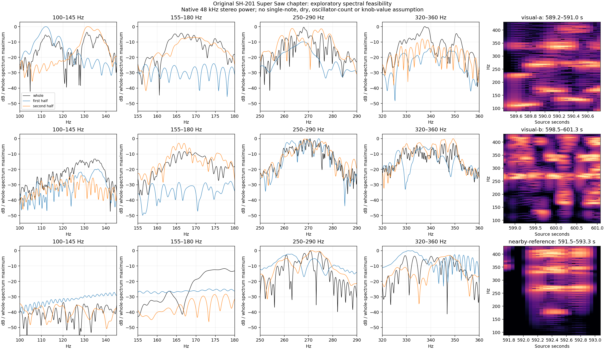

# synth-love Super Saw audio: bounded feasibility

**No sufficiently attributable set of stable Super Saw component lines was
established.** Both passages selected by the [visual audit](synth-love-supersaw-visual-2026-09-15.md)
contain changing note/group content. Their full-window spectral maxima cannot
be interpreted as one oscillator's detune offsets. The one allowed nearby
reference also contains changing groups and a large level drop. No additional
window search, spread fit or DSP change was made.

The source is the original offered full [part-2 audio](https://www.youtube.com/watch?v=OB3J7AQBla0),
SHA-256 `6ed77a823dde937f4bf87bf9cf803a7293dd21a97056f36694704355b8b15f4c`.
It is a YouTube Opus transcode of the author's recording, not an uncompressed
master. Video evidence supports Super Saw selection but supplies no exact
spread endpoint, dry-signal assertion or complete patch.

## What is measurable



The 589.2–591.0 s passage changes from a strong low-frequency group near 110 Hz
to groups near 130–140 Hz and 160–175 Hz. Its first-half strongest detected
100–180 Hz peak is 112.08 Hz; the second half is 131.67 Hz. These are observed
spectral-group locations, not recovered MIDI notes or center frequencies.

The 598.5–601.3 s passage also contains changing low-frequency groups and
relative levels. Its strongest detected100–180 Hz peak changes from 136.34 Hz
in the first half to 165.54 Hz in the second. Peaks near 270 Hz and 330–350 Hz
persist more broadly, but that does not identify their note, oscillator,
component count or relation to an effects return.

The fixed reference 591.5–593.3 s was the only extra interval inspected. Its
quarter-window RMS falls from 0.1443 to 0.00695 in the final quarter. It does
not provide an independent stationary seven-line control.

Examples from the complete peak table:

| Passage | Full-window peak, Hz | Relative level, dB | Local −3dB width, Hz |
|---|---:|---:|---:|
| 589.2–591.0 | 337.569 | 0.00 | 3.080 |
| 589.2–591.0 | 268.056 | −0.40 | 2.009 |
| 589.2–591.0 | 131.111 | −3.70 | 2.657 |
| 589.2–591.0 | 166.181 | −4.27 | 3.138 |
| 598.5–601.3 | 270.625 | 0.00 | 0.629 |
| 598.5–601.3 | 272.545 | −1.30 | 1.139 |
| 598.5–601.3 | 349.286 | −3.10 | 0.605 |
| 598.5–601.3 | 345.759 | −3.24 | 0.658 |

Some full-window maxima are narrow. Narrowness alone is insufficient:
changing excitation and unresolved mixtures can produce local maxima that
are absent or different in the two halves. The tables retain nearest-half
peaks descriptively; nearest frequency is **not** an identity match between
oscillator components. No claim that every partial is unstable is needed for
this negative calibration result.

## Method, controls and reproduction

[Tools/assess_public_supersaw_feasibility.py](../../../Tools/assess_public_supersaw_feasibility.py)
checks the original source hash, decodes at its native 48 kHz stereo rate and
averages left/right **spectral powers**. There is no sample-rate conversion,
mono downmix, channel-gain fit or audio filtering. Windows are exactly the two
visual candidates plus 591.5–593.3 s; no adaptive passage search is used.

Each full/half-window spectrum uses Hann weighting and eightfold zero
padding. Native full-window bin spacings are 0.556 Hz and 0.357 Hz; isolated Hann
−3dB widths are approximately 0.800 Hz and 0.514 Hz. Zero padding interpolates
these spectra without improving resolving power. The time-frequency plot
uses 0.5 s Hann windows, 50 ms hop and 2 Hz bin spacing.

Every detected 40–8000 Hz peak with at least 8 dB local prominence and level
within 50 dB of that spectrum's maximum is retained in the full JSON. Local
−3dB widths can include overlapping lines and are not confidence intervals.
Opposite-phase stereo sine controls at 131.125 Hz pass the peak-location and
Hann-width checks at both durations; this also guards against accidental
mono cancellation. These controls validate the measuring code, not the
hardware's component identity.

Run:

```sh
python3 Tools/assess_public_supersaw_feasibility.py --out build-fidelity/public-waveforms/synth-love/supersaw-feasibility/reproduction
```

The [compact receipt](synth-love-supersaw-audio-feasibility-2026-09-15.json)
pins the decoder command, script, source, native WAV, full tables and plot.
Full results remain at
`build-fidelity/public-waveforms/synth-love/supersaw-feasibility/run-01/results.json`.
The result supports no detune endpoint or offset estimate.
