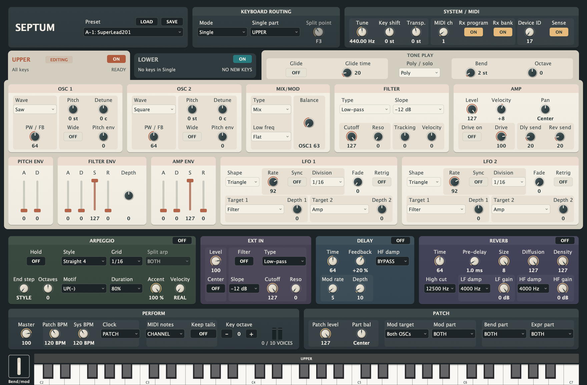

# Septum

A ten-voice virtual-analog synthesizer modelling the Roland SH-201 (2006) —
the last keyboard of the calculated-supersaw family that began with the
JP-8000. VST3 and Standalone for macOS, Linux and Windows, plus Audio Unit on
macOS.



Two complete tones — UPPER and LOWER — each running
`OSC1 + OSC2 → MIX/MOD → FILTER → AMP` with three envelopes and two LFOs,
into a shared modulation-delay → reverb chain, with SINGLE/DUAL/SPLIT
keyboard modes and 10 voices halved in DUAL. The seven-saw SUPER SAW, the
soft-clipped FB OSC comb, a multimode filter that reaches bounded
self-oscillation, the documented 32 × 16 arpeggiator grid, the rear INPUT
jacks with their four-type AUDIO FILTER, and a component-level model of the
analog output stage.

The name is Latin twice over: *septum*, a dividing wall, for the two tones
that partition every patch; and *septem*, seven, for the seven detuned
sawtooth oscillators that give the instrument its signature voice.

It is an independent original implementation, not affiliated with or licensed
by Roland Corporation, and contains no firmware, ROM data, samples, captured
audio, or factory patch data.

## Downloads

[Download compiled binaries from CI builds on main](https://github.com/protocodus/virtual-instrument-septum/actions/workflows/ci.yml?query=branch%3Amain).
Open the latest successful run, sign in to GitHub, and choose your platform
under **Artifacts**. Each download contains the distributable packages below;
artifacts are retained for seven days.

| Platform | Artifact | Distributable files |
| --- | --- | --- |
| Linux x64 | `ci-linux-septum-build-<build>` | `Septum-build-<build>-Linux-x64.tar.gz` — VST3 and standalone |
| Windows x64 | `ci-windows-septum-build-<build>` | `Septum-build-<build>-Windows-x64.zip` — VST3 and standalone |
| macOS | `ci-macos-septum-build-<build>` | `Septum-<version>-build-<build>-macOS-<arch>.pkg` and `.zip` — VST3, Audio Unit and standalone |

`<build>` is the CI run number, also included in every package filename.
macOS CI packages target the runner's native architecture, shown in the
filename; they are ad-hoc signed and are not notarized.

## Audio demos

WAV files are omitted from this repository. Generate the eleven demos locally
with the commands in [Build](#build); the output goes into `Docs/audio/` and
is ignored by Git.

Rendered by [`Tools/RenderDemos.cpp`](Tools/RenderDemos.cpp) through the same
JUCE-free `septum::Engine` the plug-in runs, at 44.1 kHz — no samples, impulse
responses or external processing anywhere. Each take is normalised to
−3 dBFS on its own peak; the pre-normalisation peak stays visible below. CI
renders and verifies the set on every push without committing the generated
audio.

<!-- peaks-table-begin: regenerated by SeptumRenderDemos; edits between the markers are overwritten -->
| File | What it is | Length | Rendered peak | Normalisation |
| --- | --- | ---: | ---: | ---: |
| `01-supersaw-lead.wav` | Both oscillators SUPER SAW: a trance line into a held stack | 8.5 s | −8.8 dBFS | +5.8 dB |
| `02-supersaw-spread-sweep.wav` | One chord while the spread knob sweeps the seven-saw detune curve | 7.8 s | −11.6 dBFS | +8.6 dB |
| `03-fb-osc-lead.wav` | FB OSC from clean saw into feedback, then a legato solo phrase | 9.7 s | −23.6 dBFS | +20.6 dB |
| `04-acid-filter-24db.wav` | The -24 dB low-pass at high resonance under a 16th-note line | 9.3 s | −29.4 dBFS | +26.4 dB |
| `05-sync-sweeper.wav` | Oscillator sync swept by the pitch envelope and by hand | 8.8 s | −24.7 dBFS | +21.7 dB |
| `06-ring-bell.wav` | Ring modulation: equal-sine product bells | 9.2 s | −17.1 dBFS | +14.1 dB |
| `07-pwm-strings.wav` | Pulse-width modulation strings through the chorus delay template | 15.8 s | −2.3 dBFS | −0.7 dB |
| `08-sub-bass.wav` | Square plus sine an octave down with the LOW FREQ boost | 8.0 s | −14.9 dBFS | +11.9 dB |
| `09-sample-hold-fx.wav` | Sample & hold LFO into the band-pass filter | 9.2 s | −5.9 dBFS | +2.9 dB |
| `10-dual-pad.wav` | DUAL keyboard mode: two complete tones layered under one hall | 23.9 s | −7.0 dBFS | +4.0 dB |
| `11-arpeggiator.wav` | One chord through the arpeggiator: UP, UP&DOWN(L&H) with a heavy shuffle, then OCTAVE RANGE +2 on HOLD | 15.1 s | −17.5 dBFS | +14.5 dB |
<!-- peaks-table-end -->

### Listening against the real instrument

Roland still hosts real-unit recordings of the modelled instrument, so each
demo names the closest official reference. Those MP3s are played on real
hardware with unknown mastering: they are by-ear references, not measurement
targets. The demos play this project's own presets, not Roland's factory
patch data, so a comparison judges the *engine's* character — spread
trajectory, FB-OSC growl, resonance behaviour, envelope snap, effect texture
— rather than patch-for-patch identity.

- [roland.com SH-201 song list](https://www.roland.com/global/products/sh-201/songlist/) — 17 official patch demos and a song demo
- [rolandus.com SH-201 patches](https://www.rolandus.com/go/sh-201_patches/) — the 2007 mini-site, 33 more demos including a supersaw comparison
- [Roland SH-201 Demo, No Talking](https://www.youtube.com/watch?v=BfDj8V3MTCo) — a no-narration real-unit run-through

| Demo | Closest real-unit reference |
| --- | --- |
| `01-supersaw-lead.wav` | [SuperSawBrs](https://static.roland.com/assets/media/mp3/sh_201_super_saw_brs.mp3), [Fat Saw Lead](https://static.roland.com/assets/media/mp3/sh_201_fat_saw_lead.mp3) |
| `02-supersaw-spread-sweep.wav` | [SH-201 vs JP-8000 supersaw](https://www.rolandus.com/go/sh-201_patches/mp3/PAD/TOP8_SH-201vsJP-8000.mp3) |
| `03-fb-osc-lead.wav` | [FB OSC Lead](https://static.roland.com/assets/media/mp3/sh_201_fb_osc_lead.mp3) |
| `04-acid-filter-24db.wav` | [Reso Bass](https://static.roland.com/assets/media/mp3/sh_201_reso_bass.mp3) |
| `05-sync-sweeper.wav` | [OSC SyncLead](https://static.roland.com/assets/media/mp3/sh_201_osc_sync_lead.mp3) |
| `06-ring-bell.wav` | RingModBell (PRESET A-4; audible in the [factory run-through](https://www.youtube.com/watch?v=lKpt2Q5GRXg)) |
| `07-pwm-strings.wav` | [SilkyStrings](https://static.roland.com/assets/media/mp3/sh_201_silky_strings.mp3) |
| `08-sub-bass.wav` | [Fat Bass](https://static.roland.com/assets/media/mp3/sh_201_fat_bass.mp3) |
| `09-sample-hold-fx.wav` | [S&H FX 2](https://static.roland.com/assets/media/mp3/sh_201_s_and_h_fx_2.mp3) |
| `10-dual-pad.wav` | [JP-8SweepPad](https://static.roland.com/assets/media/mp3/sh_201_jp_8_sweep_pad.mp3) |
| `11-arpeggiator.wav` | [Sweep Arp](https://static.roland.com/assets/media/mp3/sh_201_sweep_arp.mp3), [Electro Seq](https://static.roland.com/assets/media/mp3/sh_201_electro_seq.mp3) |

## How it works

The modelled instrument's sound engine is pure DSP: the service notes show one
Roland custom DSP ("WSP", a Toshiba-fabbed gate array) computing all synthesis
and effects, no PCM wave ROM anywhere in the design, and a documented analog
stage around the codec. A faithful replica is therefore a *behavioural model
of a DSP engine* plus a component-level model of the analog output path — not
an analog circuit simulation.

Every mechanism below is tagged by how well it is grounded. **Settled** means
a primary document pins it. **Reported** means it follows a published
measurement of related hardware, or a consistent owner/press account.
**Voiced** means this project chose the value because no source pins it —
those live in the engine's `mapping` namespace, each tagged with the open
question that owns it, so a measurement can replace one without touching the
render code. The open questions are listed under [Known gaps](#known-gaps).

**Primary sources.**

| Source | What it settles |
| --- | --- |
| Roland SH-201 Owner's Manual, 84 pp., © 2006 | Architecture, panel controls, parameter list with ranges (pp. 60–70), CC map (p. 72), MIDI chart (p. 73), specifications (p. 74), block diagram (p. 75) |
| Roland SH-201 MIDI Implementation v1.00, 2006-03-01 | The parameter contract: SysEx address map with every raw range and display mapping, enumeration orders, LFO sync-note table, effect frequency tables |
| Roland SH-201/SH-201C Service Notes, May 2006, doc 17058418E0 | NEC V850E/ME2 CPU, WSP DSP + private SDRAM, AK4552 codec, TUSB3200 USB clock master (384fs), analog I/O component values, factory test levels |
| SH-201 leaflet addendum (`SH-201_AD.pdf`) | Effect template names, `-5` → `5th` INTERVAL spec change, factory reset |
| Adam Szabo, *How to Emulate the Super Saw*, KTH bachelor's thesis, 2010 | JP-8000 Super Saw measurements: oscillator offsets, detune polynomial, mix laws, pitch-tracked HPF, free-running phases |
| Roland JP-8000 Owner's Manual + Supplemental Notes SN77 | The ancestor's supersaw/FB-OSC control semantics |
| Sound on Sound, *Roland SH-201* (Nick Magnus, April 2007) | V-Synth-derived engine, 5+5 dual/split voices, envelope snappiness, EXT-IN routing, the 24 dB filter "similar in character to that of the JP8000" |
| Roland SH-201 Editor 1.0, `BufferModel.xml` + `Resource.xml` | The editor ships its parameter model uncompiled: every parameter's SysEx address, raw range and factory default, and 36 display tables — a second witness to the address map, and the reverb PRE DELAY table the manual prints only the endpoints of |
| Roland SH-201 USB driver readmes, 2006 and 2009 | The device name the user is told to select — "Roland SH-201 44.1kHz" — from a driver whose own table carries six rates and composes the name as `<model> <rate>` |
| AKM AK4552 datasheet | Codec conversion: 24-bit delta-sigma, digital-filter passband 0.454·fs |

### Reading the panel

The SH-201-inspired panel combines a warm charcoal chassis, ivory part panels,
hardware-style knobs and flat switches with clear on/off fills. A darker warm
backing, wider gutters and lightly raised cards separate each module. Program, routing and
system controls also occupy distinct cards. Larger labels, aligned value rows
and explicit space between rows keep controls readable. Selector captions line
up with their field text; knob and fader captions stay centred on their axes.
Island titles are centred in their bars. The active Upper/Lower tab joins the
part-control page; the inactive tab sits back on the charcoal chassis. Compact
play controls share the page beside the tabs. Shorter control rows and fewer
empty margins keep the full instrument visible without shrinking its labels.
Each LFO places its source and timing controls above two matching target/depth
pairs. Oscillator Wide sits below Pitch, beside the explicitly named Pitch env
amount. Soft title
bars follow the active part's colour, with the same silkscreen lettering at
80% opacity. Shared headers use a quieter shade of their fixed panel colour.
Space separates the modules without divider rules, tab stripes or decorative
control ticks. The signal
path reads left to right: OSC 1 + OSC 2 → MIX/MOD → FILTER → AMP, with envelopes
and LFOs below. **TONE PLAY** sits beside the part selector above these panels,
keeping portamento, glide time, voice mode, bend range and part octave with the
part they edit. Terracotta identifies **UPPER** and teal identifies **LOWER**
in the selected tab, panel headers and envelope sliders.

Shared controls keep fixed colours when the edit selection changes:
**ARPEGGIO** has an olive panel, **EXT IN** has a muted plum panel, and the
remaining shared sections use charcoal. These hues are distinct from the
terracotta and teal part accents. Program selection, keyboard routing
and system settings occupy the shared header. Arpeggio, external input,
delay and reverb sit below the part panels;
**PERFORM** and **PATCH** follow beneath them. PERFORM holds master volume,
keyboard octave and tempo, while PATCH holds patch level, part balance and
controller destinations. The delay and reverb sends remain in each part's
**AMP** section because their levels belong to the selected part.
Their **Dly send** and **Rev send** labels distinguish them from the shared effects.
In PATCH, the modulation target and part form a pair, separated from the level
controls and the bend/expression destinations by wider gaps.
The keyboard extends to the bottom edge of the panel.

**LOAD** and **SAVE** beside the preset selector open native file dialogs for
`.septum` presets. Each file stores both parts, their on/off states, shared
effects and system settings, and any imported arpeggio pattern. The selector
shows the file's name after loading or saving; choose a factory sound from
the same menu to start again. Failed or cancelled loads leave the current
sound intact, and saves confirm before replacing an existing file.

All arpeggio, input-filter and effect settings are always visible in two
organized rows. There is no advanced or Details view. Arpeggio, delay and
reverb on/off switches sit in their panel headers.

A patch holds two complete parts, **UPPER** and **LOWER**. The selector above
the ivory panels distinguishes editing, enable state and sound activity:

- **The attached tab** selects the part shown by TONE PLAY, the voice
  controls, envelopes and LFOs. Its colour and the envelope slider handles
  follow the edit selection even when that part is muted. Section titles
  appear once, and the shared controls retain their separate visual group.
- **ON/OFF**, beside each part title, mutes that part and disables its sound
  controls. An OFF part can still be selected to inspect its settings; shared
  controls remain available. Re-enabling restores editing without changing values.
  Switching uses a 7.5 ms fade and preserves running notes and envelopes, so a
  held note can resume when enabled. Notes released while muted stay released.
- **Routing text** says which new keys reach the part: all keys, a split zone,
  or no keys in Single. Keyboard mode, **Single part** and the split point
  sit in the shared header; the band above the keyboard shows the same routing.
- **Activity and meters** report the engine's active voices and each part's
  signal before shared effects. PLAYING, RELEASING and READY distinguish
  sounding notes, release tails and an idle part. A routing change can leave
  an earlier note releasing in the other part.

Muting stops a part's dry signal and new effect sends. Existing shared delay
and reverb tails continue to decay, so an OFF part can leave an audible tail.
**PART BAL** still balances the parts, and **MOD/BEND/EXPR PART** still
select which part each controller reaches.

Sessions preserve both ON/OFF settings. Older sessions without these settings
start with both parts ON, as do program loads and explicit patch or SysEx file
imports. Streamed SysEx parameter edits preserve the current ON/OFF settings.
Independent mutes are a plug-in feature and are not included in SH-201 SysEx
exports.

### Architecture

*Settled.* One patch holds two complete tones. Each is
`OSC1 + OSC2 → MIX/MOD → FILTER → AMP` with a two-stage pitch envelope, filter
and amp ADSRs, and two LFOs; a shared modulation-delay → reverb chain takes
per-tone sends; SINGLE/DUAL/SPLIT keyboard modes give 10 voices, halved to 5+5
in DUAL. Every parameter and range comes verbatim from the MIDI
implementation's address map, including the waveform order (SAW, SQU, PW-SQU,
TRI, SINE, NOISE, FB-OSC, SUPER-SAW, EXT-IN), the LFO shape order, the
20-entry tempo-sync note table and the effect frequency tables.

### Oscillators

**SUPER SAW** — seven sawtooth waves inside one oscillator slot, the PW knob
setting pitch spread. *Reported*, from Szabo's JP-8000 measurements quoted
verbatim: fixed per-oscillator offsets at full detune of −0.11002313,
−0.06288439, −0.01952356, 0, +0.01991221, +0.06216538, +0.10745242 relative to
the centre frequency (cross-checked against a KVR reverse-engineering giving
≈5/256, 16/256, 28/256); the fitted 11th-degree spread polynomial implemented
verbatim; phases randomised free-running per note-on; and the saws deliberately
*not* band-limited, because the aliasing above the fundamental is part of the
signature sound. The summed stack passes a high-pass tracked to the note's
fundamental, removing folded noise below it — an RBJ 2nd-order high-pass at
1.0× f₀, Q = 0.707. The SH-201 has no supersaw MIX knob, so Szabo's mix laws
(centre `−0.55366·m + 0.99785`, sides `−0.73764·m² + 1.2841·m + 0.044372`) are
evaluated at a fixed *m* = 0.75, just past the centre/side equality point at
*m* ≈ 0.737, leaving the sides ~0.15 dB above the centre. *Voiced.*

**FB OSC** — *settled* as "a tone containing high overtones, similar to
feedback on a guitar", with one feedback control, polyphonic on both slots
where the JP-8000 ancestor forced mono and exposed two controls. *Reported*
mechanism: a sawtooth feeding a comb filter, aliasing heavily. Implemented as
a sawtooth whose soft-clipped output is delayed by half the fundamental period
and added back scaled 0…1.15, values past unity held bounded by the clip. The
half-period delay reinforces even harmonics — the octave-up emphasis of guitar
feedback. Delay ratio and gain law are *voiced*.

**The rest** — SAW, SQU, PW-SQU, TRI, SINE and NOISE are band-limited; the
triangle's own coefficient was the one that shipped un-band-limited until it
was fixed. **INTERVAL** is *settled* against OSC 1 rather than against zero
(OM p. 30): −OCT drops OSC 2 an octave below OSC 1, 5th raises it seven
semitones above, and both together put OSC 2 at OSC 1's pitch.

### Mixer, sync and ring

*Settled:* TYPE cycles MIX → SYNC → RING. SYNC restarts OSC1's cycle at each
OSC2 cycle start, implemented as the naive hard-sync reset it is documented as
— the modelled DSP's own sync aliases audibly, and no source documents
band-limiting there. RING multiplies OSC1 × OSC2, the product occupying the
OSC1 leg of the balance crossfade, so BALANCE fully left hears the ring product
alone. BALANCE −63…+63 holds each leg at unity at centre with the opposite leg
attenuating to silence at the extremes — endpoints settled, law *voiced*. LOW
FREQ CUT/FLAT/BOOST is a first-order low shelf, *voiced* at 200 Hz ± 8 dB.

### Filter

*Settled:* LPF/HPF/BPF/BYPASS at −12 or −24 dB/oct; cutoff and resonance
0–127; resonance far right reaches sustained self-oscillation, exactly as the
manual warns; KEY FOLLOW −200…+200 in steps of 10, the p. 36 diagram placing
the pivot at C4 with +100 tracking the keyboard 1:1 and +200 at 2:1.
*Reported:* the 24 dB filter is "similar in character to that of the JP8000"
(SoS) — a clean digital resonant filter, not a modelled analog ladder.

Implemented as a TPT state-variable filter. The −12 dB voice path uses one
resonant section; −24 dB adds a second section with Q capped at 2. An empirical
calibration from SupaJuce 1 and Air Lead 1 recordings strengthens the original
resonance curve: for positive base damping `b = 2 − 2.04·√(v/127)`, the voice
uses `k1 = 2·(b/2)^1.5` at raw 40 and above. Dry LP12/LP24 hardware recordings
now anchor `k1 = 1.2` at resonance zero; a provisional straight interpolation
joins that endpoint to raw 40. Both regions use `k2 = clamp(k1, 0.5, 1.2)`.
The first section's self-oscillation threshold retains its prior behavior.
The modeled raw40 peak rises from about 2.2 to 10.8 dB. This is a recording-informed
model, not a recovered Roland topology or complete Q table. The separate
AUDIO FILTER retains its original curve. See the
[resonance investigation](Docs/fidelity/resonance-investigation.md) and the
[dry filter calibration](Docs/fidelity/dry-filter-calibration.md), which records
the isolated improvement and mixed results on wet factory demos.
Cutoff maps exponentially over 20 Hz → 20.48 kHz; cutoff velocity sensitivity
±63 spans ±4 octaves. Filter-envelope depth ±63 now spans ±12 octaves linearly.
The previous ±10 range left SupaJuce's early resonant peak about an octave too
low. The 12-octave range is an empirical correction supported by several notes
and an independent Cotton Wool comparison; its extremes remain unmeasured.
See the [brightness investigation](Docs/fidelity/brightness-investigation.md).

The cutoff sum is assembled in two parts, deliberately. The *panel* side —
cutoff knob, key follow, velocity offset, LFO — passes a 2.5 ms one-pole slew
that models nothing the hardware does and exists only so a patch edit or an
S&H LFO edge cannot put a discontinuity into the coefficient. The envelope's
own level bypasses this extra slew so its selected segment timing reaches the
filter directly. Both stages' coefficients then walk sample by sample across
the control tick, avoiding a staircase when the envelope moves.

### Envelopes

*Settled:* PITCH ENV is attack/decay only with shared A/D and per-oscillator
signed depth; FILTER ENV is ADSR with signed depth; AMP ENV is ADSR; all
sliders 0–127. *Reported:* "fast ADSR response times ensure bags of punch"
(SoS). *Voiced:* linear-ramp attack, with attack times mapping exponentially
over 1 ms → 5 s. Amp/pitch decay and envelope release remain exponential,
with the existing 2 ms → 12 s mapping measured to −60 dB. Filter decay uses a
separate linear segment: raw 49 takes approximately 419 ms, an empirical anchor
from conditional Moogie hardware-audio analysis. A provisional power curve
interpolates the other values between 2 ms and 12 s; those values and the
segment curvature are not a measured Roland table. See the
[filter investigation](Docs/fidelity/filter-darkness-investigation.md).
A stolen voice in POLY restarts its envelope from its current level.
Pitch-env depth ±63 now reaches ±12 semitones:
the one-octave limit is *reported* in Jim Aikin's firsthand SH-201 review
(Electronic Musician, March 2007, p. 92); the linear taper remains *voiced*.

### LFOs

*Settled:* two identical LFO parameter sets per tone; shapes TRI, SIN, SAW, SQR, TRP, S&H (one
change per cycle) and RND; rate 0–127 or the 20-entry tempo-sync table against
the patch tempo; fade time; key trigger restarting the cycle on a key press;
destination 1 ∈ {PITCH1, PW1, FILTER, AUDIO-FILTER}, destination 2 ∈ {PITCH2,
PW2, AMP}, each with a signed depth whose negative half inverts the waveform.
With KEY TRIGGER on, each voice has its own LFO phase (*reported*, Aikin p. 93);
otherwise the waveform free-runs across the tone. Each note has its own fade.
The single external AUDIO FILTER retains a shared modulation source.
*Measured endpoints:* free rate runs from a 20.59 s period to 40.22 ms
(approximately 0.04857–24.863 Hz), from
[deep!sonic's hardware timing table](https://www.deepsonic.ch/deep/docs_misc/deepsonic_analytics_-_envelope_lfo_speed.pdf).
Intermediate rates retain provisional logarithmic interpolation; the complete
hardware control table and measurement tolerance are unpublished. Rendered
audio verifies both LFO endpoints and unchanged tempo-sync periods.
*Voiced:* the trapezoid as
rise-¼/high-¼/fall-¼/low-¼, RND as linearly interpolated random targets per
cycle against S&H's stepped ones, fade time `(v/127)² × 10 s`, and the depth
scalings — pitch ±1 octave with a squared taper, PW the full parameter span,
filter ±5 octaves, amp up to ±100 % level.

### AMP, overdrive and pan

*Settled:* LEVEL 0–127; OVERDRIVE is an insertion effect in the AMP section,
"similar to vacuum tube amplifier distortion", DRIVE 0–127, LEVEL still acting
as clean volume; hidden PAN L64–63R; LEVEL VELOCITY SENS ±63. *Voiced:* drive
maps to 0…32 dB of pre-gain into a tanh clipper, output-compensated by
`pre^−0.4` to hold loudness roughly constant; LEVEL is a squared amplitude
law; pan is equal-power.

Where the shaper is evaluated is a separate question from what it computes.
The overdrive runs at a fixed internal rate through half-band polyphase stages
with antiderivative anti-aliasing, so its character does not follow the host's
sample rate.

### Arpeggiator

*Settled mechanism, original styles.* The documented 32 × 16 style grid, with
GRID including the shuffled divisions, DURATION with tie chains and FUL, all
twelve MOTIF values, OCTAVE RANGE, ACCENT, ARPEGGIO VELOCITY, END STEP with a
`STYLE` position that defers to the template's own length, HOLD and SPLIT
ARPEGGIO. The manual prints three worked examples of the motif mapping and
they are the test: the implementation reproduces all three exactly, including
the documented fallback that plays the highest pressed key by default.
Roland's 32 factory styles are unpublished data and none ships here — the 16
styles supplied are original patterns.

CLOCK now selects PATCH, SYSTEM, incoming MIDI/USB timing clock, or HOST tempo
for the arpeggiator and synchronized LFOs. HOST follows BPM; transport/bar phase
alignment remains separate. See the [ranked fidelity research and validation](Docs/fidelity/five-further-improvements.md).

### External input

*Settled.* The rear INPUT jacks with INPUT VOL, CENTER CANCEL and the AUDIO
FILTER — LPF/HPF/BPF/**NOTCH** at −12 or −24 dB — none of it stored in the
patch, exactly as the manual says three separate times. CUTOFF answers on
CC#2 and RESONANCE on CC#4. The EXT-IN waveform plays the input through the
voice in mono, and the direct monitor hands the input over while it does; the
manual's own "sound only when you play the keyboard" recipe is what settles
that order, and it is a test. With no input bus connected an EXT-IN oscillator
renders silence, as the hardware does with nothing plugged in.

### Hardware that is not here

- **The D Beam.** An infrared distance sensor is a control surface, and a
  plug-in has no hand above it. The four Patch Common bytes the beam owns —
  its destination, ACTIVE EXPRESSION, its assign and its polarity — are still
  stored, saved, program-changed and round-tripped, so a dump from a real unit
  survives the trip and a dump Septum writes never asserts a beam setting it
  invented. They are published as non-automatable: a host should not offer a
  lane that cannot change what the player hears. CC#69, the beam's own
  controller, is accepted and ignored. PITCH WIDE is a hardware control-range
  setting: SysEx and panel pitch CCs use it to select ±12 or ±36 semitones;
  native pitch parameters already store physical semitones.
- **The step recorder** and **tap tempo**.

### Effects

A shared modulation delay → reverb chain with per-tone sends, the eight delay
templates (Simple Delay … Chorus 1/2) and eight reverb templates (Room 1 …
Plate 2) implementing the *settled* template names with this project's
*voiced* values.

Effect inputs and wet returns fade over 5 ms when toggled. Once bypassed, the
networks continue decaying with no new input. Fractional delay positions use
four-point Lagrange interpolation to reduce unintended treble loss in repeats.
These are plug-in quality choices; the hardware's exact effects algorithm remains open.
[Five additional sound-quality fixes and verification](Docs/fidelity/quality-round2.md)
also cover SysEx timing and smoother volume, expression and pan changes.

### Analog output stage

The [service schematic, printed pp. 36–37](https://www.synthxl.com/wp-content/uploads/2020/01/Roland-SH-201-Service-Manual.pdf#page=30)
shows an **active Sallen–Key filter**: C219 returns to the op-amp output, so
the two capacitors cannot be modelled as independent RC poles. The engine now
solves the component-derived transfer including 4.7 kΩ/8.2 kΩ, 270 pF/820 pF,
the 33 kΩ/22 kΩ feedback network and its 10 pF capacitor. It also models the
22 µF/22 kΩ input coupling. Nominal gain is normalised to preserve patch levels.

The circuit runs at 8× with bilinear discretisation and bandlimited conversion.
Measured against independent nodal analysis, the maximum error at 44.1 kHz is
0.046 dB and 0.42° across 20 Hz–20 kHz after removing conversion delay. This
validates the numerical circuit model, not a complete hardware match. The extra
74 samples are included in host latency compensation: total latency is 93
samples at 44.1/48 kHz, 90 at 96 kHz, and 74 at 192 kHz.

This is a linear, ideal-op-amp model. The loaded master-volume pot, remaining
line/headphone circuitry, finite op-amp bandwidth, noise and the codec's digital
filter are not yet reproduced. The service test's roughly −4 dB at 20 kHz is
an **analog-input loop-through** result and is not a synth-output-only target.
See [fidelity measurements and reproduction commands](Docs/fidelity/README.md).
The [hardware audio benchmark](Docs/fidelity/hardware-audio-benchmark.md) includes
three listening comparisons against acquired Roland demos, using published
presets and explicitly labeled MIDI reconstructions, plus source hashes and
reproduction tools. Original performance MIDI was not found in the audited sources.
The [follow-up audit](Docs/fidelity/hardware-benchmark-audit.md) verifies the
librarian extraction against paired author SysEx files and measures velocity
sensitivity across 381 additional renders. It fixes fragmented SysEx reception,
restores Super Saw oscillator SYNC, and adds a revised Moogie 1 transcription.
The [filter darkness investigation](Docs/fidelity/filter-darkness-investigation.md)
checks the actual filter response and identifies overly fast Moogie filter decay.
The selected production correction adopts the approximately 419 ms linear
filter decay at raw 49, with explicitly provisional interpolation elsewhere.
It preserves cutoff, amplifier/pitch envelopes and filter release; Dist Bs 1
and Cotton Wool retain audible differences. Historical candidate A/B clips
are kept separate from production verification.
The [WIDE pitch correction](Docs/fidelity/wide-pitch-correction.md) fixes another
large mismatch: normal-range oscillator pitch was imported as three octaves
instead of one. Four updated comparisons retain original presets and disclose
the revised MIDI reconstructions. Existing native sessions preserve their
pitches; re-import original hardware SysEx to apply the corrected interpretation.

### Voice allocation and MIDI

Ten voices, halved in DUAL, with solo/legato and portamento. The *settled* CC
map from owner's manual p. 72 is honoured for both tones and the part
controllers, including both documented pedals — hold CC#64 and sostenuto
CC#66 — the audio filter's CC#2 and CC#4, and the printed CC#88 collision
resolved to CC#83. Sostenuto holds only the keys that were down when it went
down; a note caught by both pedals releases only when both are up, and a
stolen voice loses its latch, since the latch belonged to the note the pedal
caught and not to the physical voice.

SYSTEM / MIDI adds receive channel 1–16 (ALL is a plug-in compatibility option),
Receive Program Change, SysEx Device ID 17–24 and Receive Active Sensing.
New instances receive channel 1; older sessions and native presets migrate to
ALL. Active Sensing starts only after FE and resets sound and performance
controllers after a message gap exceeding 420 ms. Live SysEx matches the selected
device or broadcast; explicit file imports accept any device ID.

MIDI NOTES selects DIRECT (sound-generator input, bypassing the arpeggiator
and keyboard transpose/octave), REMOTE (any-channel keyboard performance
through the arpeggiator), or CHANNEL (the existing selected-channel keyboard
behavior, retained as the compatibility default). MASTER KEY SHIFT and tone
pitch controls still apply to DIRECT notes. REMAIN keeps old voices' tone and
controllers across program selection while sharing the existing effect
network and ten-voice budget. New controls save in native preset format 6;
earlier formats migrate explicit defaults.

The [ten additional fidelity improvements](Docs/fidelity/ten-more-improvements.md)
rank these changes alongside AMP-envelope latency alignment, SPLIT voice
allocation, MIDI mono/poly modes, fractional MIDI-file tempo, and smoother
balance/send and reverb geometry edits. Their source audits distinguish
documented behavior from inference and numerical quality choices.

### Presets

Sixty-four program slots are built into the binary (`Source/DSP/SeptumPresets.cpp`):
32 original presets and 32 initialized USER slots. These are Septum sounds,
not Roland factory patch data. Explicit MIDI bank selection uses MSB 87 and
LSB 0 (PRESET) or decimal 20 (USER), followed by program 0–31. Bare program
changes retain the plug-in's flat 0–63 map until a bank is selected. RX BANK
and RX PROGRAM are independent switches. Host sessions store the complete
parameter state, including edited sounds.

## Known gaps

**Not modelled.** The recorder, SysEx *transmit* and the RQ1 reply, and the
USB audio topology are documented but deferred. The codec's own digital
filter is not separately reproduced; a host converter does not establish an
equivalent AK4552 response. Receiving DT1 is modelled: the
codec reads the documented address map, a DT1 addresses a byte rather than a
block, and a payload that would run off the end of its block is refused in
full. A patch **name** is the one field a load still drops — twelve
characters with no parameter to live in.

**Open calibration questions.** Each names the measurement that would close
it; the constants they own are tagged in the engine's `mapping` namespace.

| # | Question | What would close it |
| --- | --- | --- |
| OQ-01 | The documented USB device stream is 44.1 kHz; the internal rate of every synthesis block and the oscillator interpolation/aliasing are not proved by that alone. An isolated 44.1 kHz reference engine now demonstrates host-rate consistency, but changes control cadence, costs more CPU and adds input/output conversion delay. The plug-in still uses the native-rate engine. | Resolve prototype timing/CPU gates; compare alias lines against identifiable dry hardware references |
| OQ-02 | The CC#88 collision, read here as CC#83 | Capture the panel's transmitted CCs while moving UPPER filter-env D and LOWER OSC2 pitch-env depth |
| OQ-03 | Noise colour; pulse-width endpoints | Spectral capture of the NOISE wave; scope capture of PW at 0/64/127 |
| OQ-04 | Supersaw HPF — 1.0×f₀ Q=0.707 here, against a KVR fit proposing 2.5×f₀ Q=√2; both defensible | FFT below and around the fundamental of one dry supersaw note |
| OQ-05 | Supersaw fixed centre/side mix; *m* = 0.75 is voiced | FFT of a hardware note at zero and full spread |
| OQ-06 | FB-OSC comb delay ratio, feedback law, in-loop nonlinearity | Capture feedback-knob sweeps at fixed pitch, match partial structure |
| OQ-07 | BALANCE law; LOW FREQ shelf corner and gain | Capture BALANCE at −63/−32/0/+32/+63 with dissimilar waves; fit the shelf from a saw |
| OQ-08 | Filter calibration — cutoff-to-Hz table, resonance-to-Q curve, oscillation onset, whether −24 dB puts resonance on one stage or both, envelope and velocity depth scalings | Measure a real unit's swept responses at a grid of knob values |
| OQ-09 | Envelope time tables and segment curvature; filter decay now has a conditional empirical anchor of about 419 ms at raw 49, with provisional interpolation and linear shape | Measure attack/decay/release at slider 0/32/37/49/58/64/96/127 from dry captures |
| OQ-10 | LFO interior rate table, trapezoid segment ratios, RND smoothing, depth scalings; free-rate endpoints now follow published 20.59 s / 40.22 ms hardware periods | Capture PWM audio across intermediate rates; scope filter-cutoff modulation |
| OQ-11 | Overdrive transfer curve | Capture a sine through DRIVE 0/32/64/96/127 and fit the static curve |
| OQ-12 | Effect calibration — delay TIME-to-ms, the 16 template parameter sets, reverb RT60 per TIME/SIZE. Reverb PRE DELAY is now *settled*: the manual prints only the endpoints, and Roland's editor gives the table — four regular runs, 0.1 ms steps to 4.9, 0.5 ms to 9.5, 1 ms to 49, 2 ms to 100. Read linearly, raw 50 sat at 40 ms where the unit puts it at 5 | Tap the repeats; dump SysEx after applying each template |
| OQ-13 | Voice-steal policy | Play 11 notes and observe which voice drops |
| OQ-14 | External-input calibration — INPUT VOL taper, audio-filter cutoff and resonance curves, whether it self-oscillates, what CENTER CANCEL actually outputs, modulation depths | Capture INPUT-to-OUTPUT response across audio-filter settings; feed a known stereo signal with CENTER CANCEL on and off |
| OQ-15 | Arpeggiator calibration — shuffle amounts behind 1/8L, 1/8H, 1/16L, 1/16H; the ACCENT blend; the OCTAVE RANGE cycle order; how a PHRASE style's rows become intervals | Record the arpeggiator's MIDI output across GRID, ACCENT and OCTAVE RANGE and read note times and velocities straight off it — the one open question here that a MIDI capture alone can close |
| OQ-16 | *Withdrawn, not answered.* The D Beam is a control surface a plug-in has no hand above, so the question has nothing to calibrate here. Its four bytes are still stored and round-tripped | — |
| OQ-18 | *Answered against what the codec wrote.* The address map prints the LFO Tempo Sync Switch `ON, OFF` where all 26 other switches read `OFF, ON`. It is the misprint: Roland's editor gives it no entry in the `inverse0-1Table` its three genuinely inverted parameters use, and binds it to the same latch button as ARPEGGIO, DELAY and REVERB — all off at 0. Two of Roland's own 2007 demo recordings carry the byte as 1 with SYNC NOTE 2 at PATCH TEMPO 120, and sweep at 15.91 s and 16.06 s against the 16.0 s eight whole notes predict | — |
| OQ-19 | Super Saw SYNC is now active; the chosen all-seven slave reset and center-saw master trigger are unmeasured topology choices. FB OSC, noise and external-input slave behavior remain unresolved. | Capture MIX/SYNC with isolated oscillator assignments, fixed MIDI/patch bytes and effects off; inspect phase and spectral repetition |

A SysEx dump of the factory bank would additionally give regression vectors
for the parameter codec and settle the bank-select LSB discrepancy (manual
p. 84 says PRESET LSB 64; MIDI implementation p. 1 says LSB 0 for preset and
20H for user). That data is Roland's and none ships here; the plug-in already
loads user-supplied dumps.

**Concurrent MIDI and host writes.** Complete host program, patch and session
transactions serialize their parameter writes. A transaction takes priority
over overlapping MIDI parameter edits; notes and pedal releases continue.
UI notification uses a separate policy: colliding parameter messages enter a
fixed 256-message FIFO and replay before newer parameter messages once
notification finishes. An explicit host transaction invalidates older queued
edits. If that queue fills, the oldest parameter edit is discarded to retain
the newest controls; note and pedal events never enter it. The audio callback
never waits for the host writer. Same-sample events otherwise retain the host's
supplied order, and out-of-block timestamps clamp to the block boundaries.

See [release validation](Docs/release-readiness.md) for stress tests, sanitizer
builds, CPU benchmarking, multicore offline rendering and distribution gates.

## Release history

### Unreleased

- Hardened malformed parameters, nonfinite external input, SysEx/MIDI parsing,
  host-state loading and processor lifecycle boundaries; added seeded fuzzing,
  sanitizer CI, allocation audits and strict VST3 validation.
- Removed callback buffer growth and MIDI publication allocations, fixed
  concurrent patch publication and UI note overflow, and made host-state recall
  normalize on/off parameters after fractional automation.
- Cached unchanged effect coefficients and added deterministic `--jobs` demo
  rendering across independent engine instances.
- Added full bundled dependency notices and commercial macOS packaging checks,
  with notarized/stapled ZIP bundles and installer validation.
- Increased the filter-envelope range from ±10 to ±12 octaves after named
  hardware recordings showed its peak cutoff opening too little. SupaJuce's
  early upper harmonics improve across six notes; Cotton's opening high band
  provides an independent check. Cutoff, resonance and envelope timing retain
  their prior behavior. The range remains an empirical calibration.

- Strengthened voice-filter resonance from two independent recorded patches.
  The 24 dB path now adds bounded resonance in its second section. Zero
  resonance, external AUDIO FILTER and existing cutoff/envelope timing remain
  unchanged. The moderate Q calibration and high-range cap are empirical.

- Corrected WIDE-dependent hardware coarse tuning in SysEx and pitch CCs:
  the normal range is ±12 semitones, WIDE is ±36. Retained raw pitch positions
  across CC/SysEx fragments and preserved native-session pitch semantics.
  Added a fourth hardware comparison and revised the labeled transcriptions.

- Adopted a dedicated linear filter decay after the Moogie hardware comparison
  showed the old curve closing too soon: approximately 419 ms at raw 49, with
  provisional power interpolation between 2 ms and 12 s. Filter release,
  cutoff, amplifier and pitch envelopes retain their existing behavior;
  this does not establish a complete hardware envelope table.
- Implemented [ten further hardware-fidelity corrections](Docs/fidelity/hardware-round3.md):
  polyphonic keyed LFOs, individual note fades, the reported pitch-envelope
  limit, codec input DC filtering, signed linear delay feedback, sample-grid
  arpeggio timing and four MIDI reception behaviors, with source-linked tests.
- First complete instrument: both tones with every tone parameter, all nine
  waveforms, MIX/SYNC/RING, the filter, three envelopes, two LFOs with tempo
  sync, overdrive, delay → reverb with per-tone sends and the 16 templates,
  SINGLE/DUAL/SPLIT with 10/5+5 voices, solo/legato, portamento, per-tone
  pitch bend, the System Common tune, key shift, octave and transpose, and the
  analog output stage.
- Added the arpeggiator: the documented grid, duration and tie chains, all
  twelve motifs held to the manual's three worked examples, octave range,
  accent, velocity, END STEP as a parameter and a panel control, hold and
  split.
- Added the external-input path — INPUT VOL, CENTER CANCEL, the four-type
  AUDIO FILTER, and EXT-IN as a selectable oscillator waveform — with the
  monitor/voice changeover the manual's own recipe settles.
- Added a faithful SysEx codec for the documented address map and the
  64-patch matrix.
- Overdrive is evaluated at a fixed internal rate through half-band polyphase
  stages, so its character no longer follows the host's sample rate; its stage
  state now survives a voice takeover and its own switch.
- Registered every voiced constant in the engine's `mapping` namespace with
  the open question that owns it — no bare numbers left in the render code,
  and the demos re-rendered bit-identically.
- Re-pinned the resonance curve to a square-root taper chosen by ear, after a
  linear taper put the control's whole audible range in the top fifth of its
  travel.
- Fixed the band-pass so it gains with resonance instead of losing 21 dB
  across the top of the knob and returning inverted past the oscillation
  threshold.
- Band-limited the triangle, which the shipping coefficient did not.
- Let a hard-sync reset be the naive reset it is documented as.
- Made INTERVAL an interval against OSC 1, and printed what the manual prints
  for KEY FOLLOW, delay FEEDBACK and PITCH WIDE.
- Fixed sostenuto so it no longer catches later presses, and stopped the
  octave cycle leaving the MIDI range.
- Rebuilt the panel around a fixed control geometry that scales to the window,
  lighting bipolar knobs from zero.
- Removed the D Beam, which is a control surface a plug-in has no hand above.
  Its four Patch Common bytes stay stored and round-tripped, published as
  non-automatable so a host offers no lane that changes nothing; PITCH WIDE
  now follows the same inert-data rule.
- Made the panel say which tone it is editing: EDIT TONE in the header, every
  per-tone section wearing the tone's name and colour, no mixed sections, and
  a key band that draws the split point where it falls. The drawn keyboard was
  applying the octave shift twice.
- Removed three mechanisms that asserted facts no source supports — a "tube"
  stage ahead of the overdrive, NOISE read from an LFSR's successive states,
  and a re-pinned second filter stage — and re-read the parameter address map
  in full, which corrected six bytes, made block addresses absolute, made the
  arpeggio grid sixteen blocks rather than one, and made a DT1 address a byte
  rather than a block.
- Answered OQ-01's rate half and OQ-18 from Roland's own editor XML, driver
  readmes and demo recordings, and re-pinned reverb PRE DELAY to the editor's
  four-run table.
- Made INIT PATCH Roland's INIT PATCH — all 103 declared defaults — and moved
  the neutral base the 32 original programs were written against to a private
  `presetBase()` that makes no claim about the instrument.
- Made an imported arpeggio grid survive and play: it is held beside the
  parameters, plays in place of the selected template until the selector
  moves, is saved with the session and survives a re-export.
- Fixed the resonance knob, which was not monotone — the state limiter left
  the whole high-Q shoulder unbounded below RESONANCE 122, and one knob step
  fell 17.8 dB; a SUSTAIN moved under a settled note, which stepped in one
  sample; and NOISE, which was 5.92 dB quieter at 192 kHz than at 44.1.
- Fixed All Notes Off, which was a second All Sounds Off, and added the three
  Universal Realtime messages the implementation lists.
- Fixed the publish protocol between the audio and message threads across
  several rounds: every republish now publishes the value the engine renders
  from, a state save can no longer serialise a patch that never existed, and
  a save no longer destroys the arpeggio grid it is saving. The remaining
  whole-patch and notification collisions now use the policy documented above.

## Build

Linux and CI — the JUCE-free DSP core, tests and demo renderer:

```bash
cmake -S . -B build -DCMAKE_BUILD_TYPE=Release -DSEPTUM_BUILD_PLUGIN=OFF -DBUILD_TESTING=ON
cmake --build build --parallel && ctest --test-dir build --output-on-failure
./build/SeptumRenderDemos Docs/audio
```

The full plug-in (JUCE 8.0.14 is fetched pinned at configure time, or pass
`-DSEPTUM_JUCE_PATH=/path/to/JUCE`):

```bash
cmake -S . -B build -DCMAKE_BUILD_TYPE=Release -DBUILD_TESTING=ON
cmake --build build --parallel && ctest --test-dir build --output-on-failure
```

On macOS, `./scripts/build-macos.sh` drives the same build through Xcode as a
universal binary and renders the committed editor screenshot while the suite
runs. VST3 + Standalone also build on Linux and Windows; CI exercises all
three platforms.

To package a local macOS build as a distributable installer and ZIP, supply a
numeric build number (CI uses its run number automatically):

```bash
BUILD_NUMBER=42 ./scripts/sign-and-package-macos.sh
```

The packages are written to `build-macos/dist/`, for example
`Septum-0.9.0-build-42-macOS-universal.pkg` and the matching `.zip`.

The plug-in declares a stereo input bus for the modelled instrument's INPUT
jacks. It is disabled by default, so a host that gives a synthesizer no input
loads Septum unchanged; enable it to feed the AUDIO FILTER and the EXT-IN
waveform.

## Licensing

Original code under the MIT license (`LICENSE`). JUCE is used under its own
terms — see `THIRD_PARTY_NOTICES.md`.
